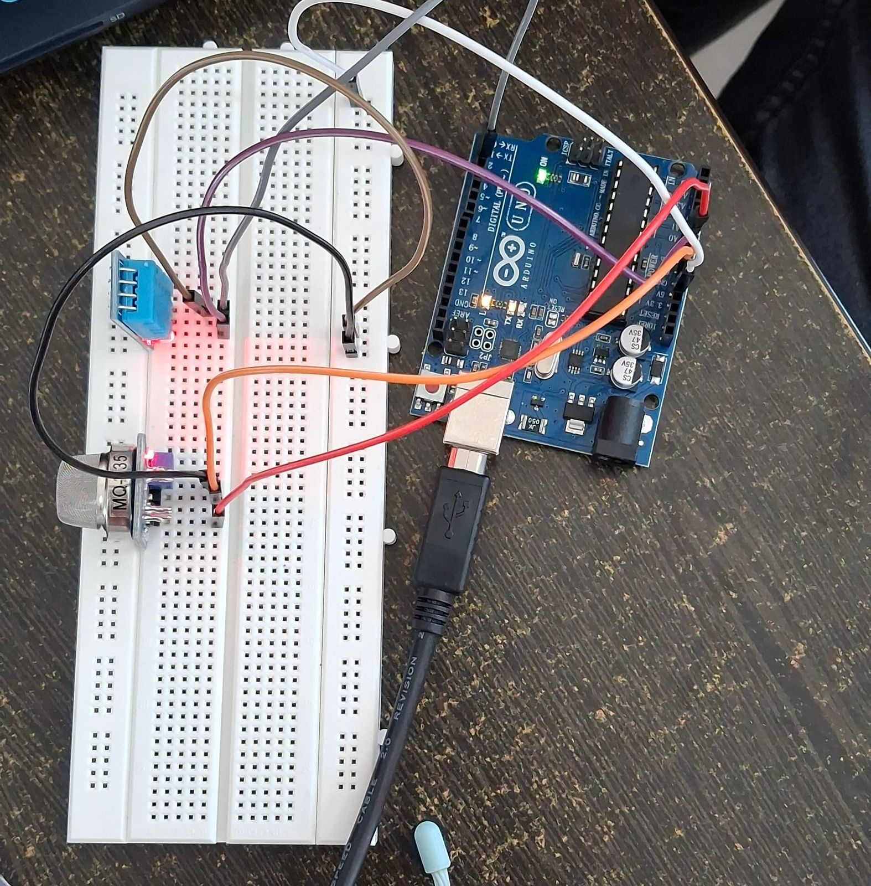
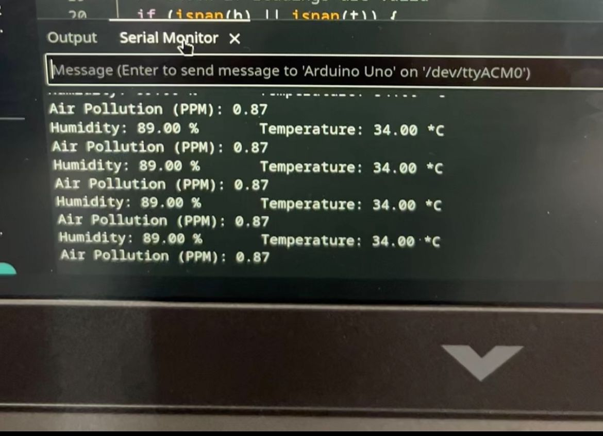

# Arduino_Projects

## 1. Air Pollution monitoring system with temperature monitoring
The following IOE project is created as for the SDG goal 13 (Climate Action).\
The project is created using MQ135 and DHT11 to monitor the Air quality, temperature and humidity.\
MQ135: Used to measure wide variety of gases present in the surroundings.
DHT11: Used to measure humidity in the atmosphere
The source code of the project is given in 

